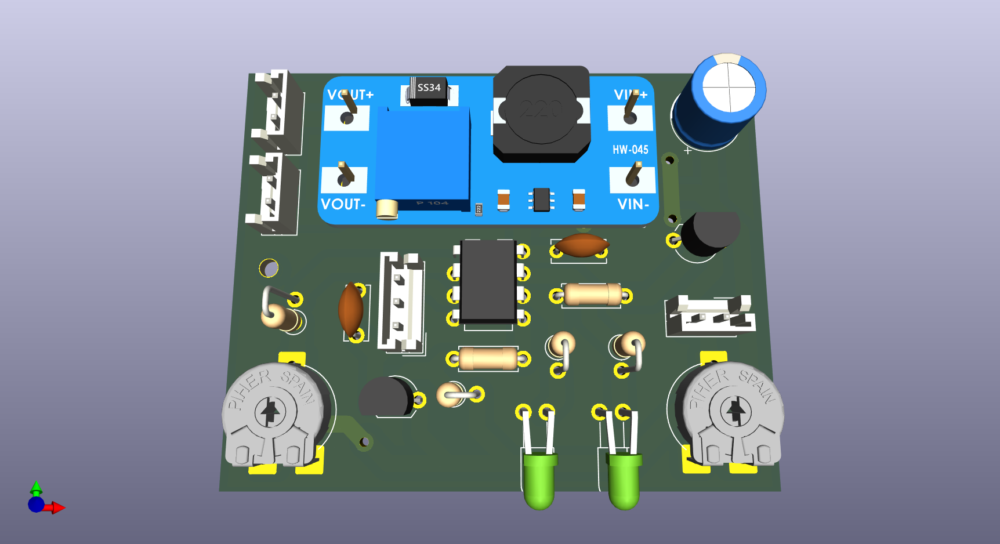
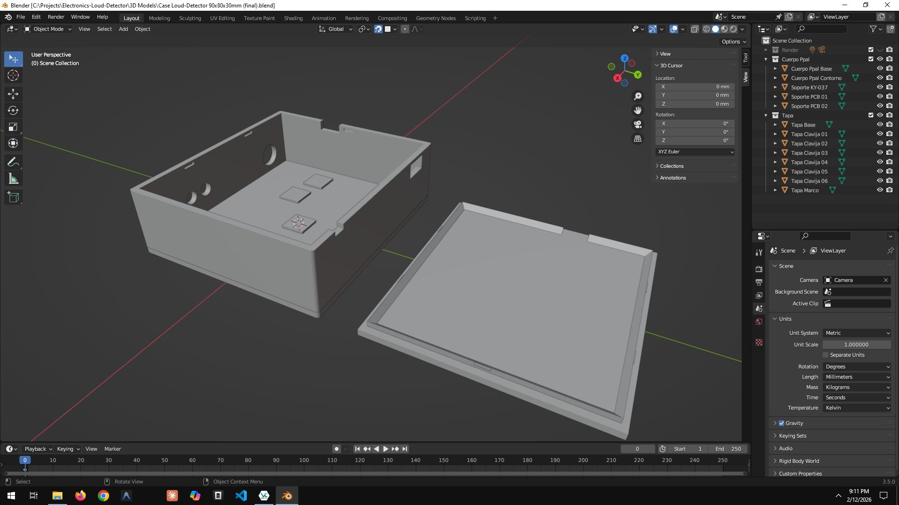
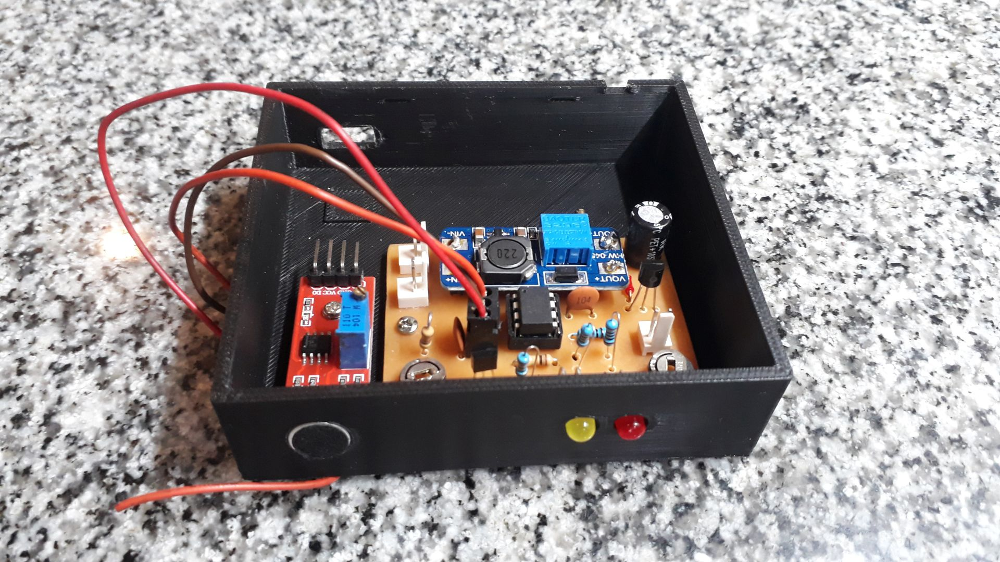
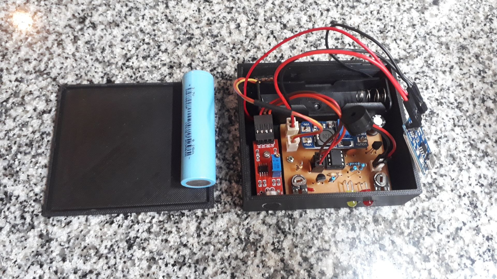

# Loud Detector

A loud detector based on ATtiny85.  
Sensitivity threshold and buzzer volume can be configured through trimmers.  
Schematics diagram + PCB diagram (KiCAD 9) and case 3D model (Blender) are also provided.  

&nbsp;

### Features & Notes:

- Sound detection via peak-to-peak window (robust)
- Sensitivity (threshold) via RV1 ADC
- Volume is 100% analog (RV2 in series with buzzer)
- Buzzer + LED share PB1 (digital ON/OFF)
- Mic power gating via PB0 (high-side PNP typical => logic inverted)
- Power input: 18650 battery

&nbsp;

### List of Materials

- 1 x ATtiny85 IC
- 1 x KY-037 Audio sensor module
- 1 x BJT Transistor BC547
- 1 x BJT Transistor BC557
- 1 x 10k ohms trimmer
- 1 x 500 ohms trimmer
- 2 x LED (yellow + red)
- 1 x Buzzer (pasive)
- 1 x Resistor 470 ohms
- 1 x Resistor 1k ohms
- 1 x Resistor 10k ohms
- 2 x Resistor 2k ohms
- 1 x Resistor 100k ohms
- 1 x Capacitor 100 uF (electrolitic)
- 1 x Capacitor 10 uF
- 1 x Rocker Button (power on/off)
- 1 x MT3608 DC/DC Step-Up Converter Module
- 2 x Bornier connector 2-pins / 2 x JST connector 2-pins
- 2 x Header connector 2-pins
- 1 x 18650 battery
- 1 x 18650 battery holder
- Wires

&nbsp;

### Screenshots

| Breadboard                                           | Assembly                                             |
|------------------------------------------------------|------------------------------------------------------|
|                      |                        |

| Assembly                                             | Assembly                                             |
|------------------------------------------------------|------------------------------------------------------|
|                    |                    |

| Schematics Diagram                                   | PCB Layout                                           |
|------------------------------------------------------|------------------------------------------------------|
|              |                      |

| PCB Render 3D                                        | PCB Render 3D                                        |
|------------------------------------------------------|------------------------------------------------------|
|             |            |

| Case 3D Model                                        | Project Final                                        |
|------------------------------------------------------|------------------------------------------------------|
|                   |                |

| Project Final                                        | Project Final                                        |
|------------------------------------------------------|------------------------------------------------------|
|                |                |

See 'Resources' folder for more pictures & videos of the project.

&nbsp;

### Version History

v1.0 (2026.01.24) - Adding schematics, PCB layout and base firmware.  
v1.1 (2026.01.25) - Update firmware: adding 'low-power' feature.  
v1.2 (2026.01.27) - Adding case 3D model.  
v1.3 (2026.01.31) - PCB minor improvements.  
v1.4 (2026.02.02) - Case 3D model minor improvements.  
v1.5 (2026.02.12) - Case 3D model minor improvements, update 'README.md'.  

&nbsp;

This source code is licensed under GPL v3.0  
Please send me your feedback about this project: andres.garcia.alves@gmail.com
